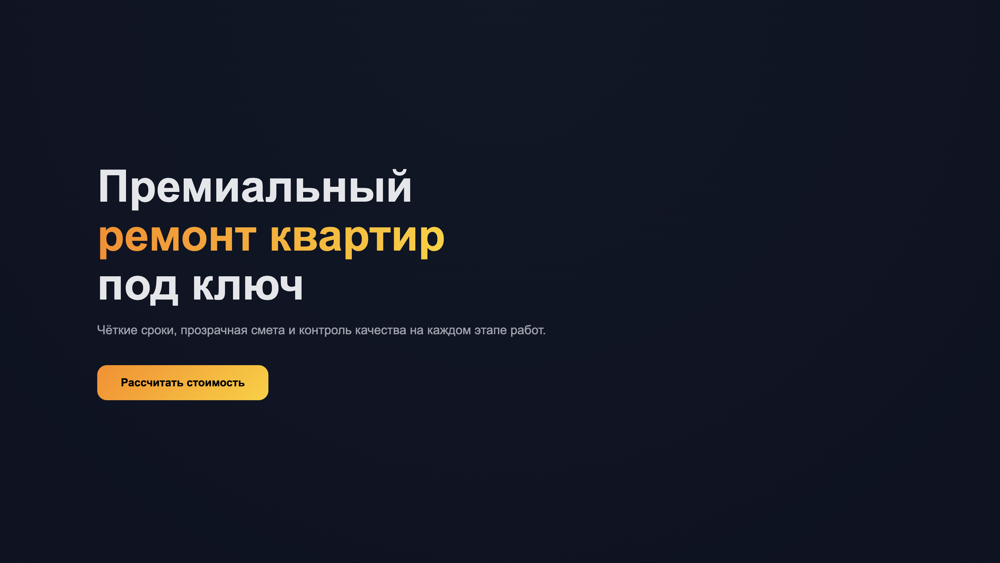
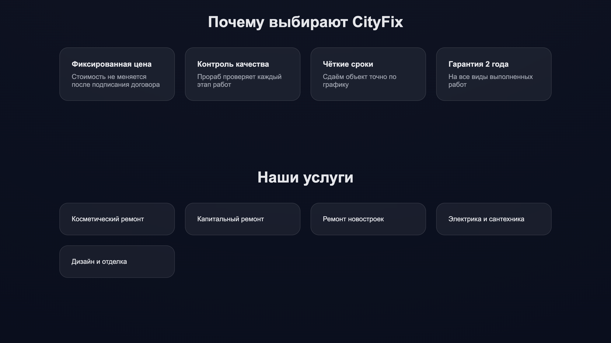
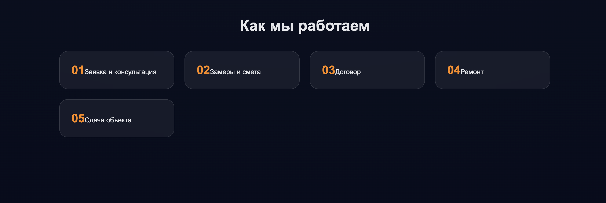
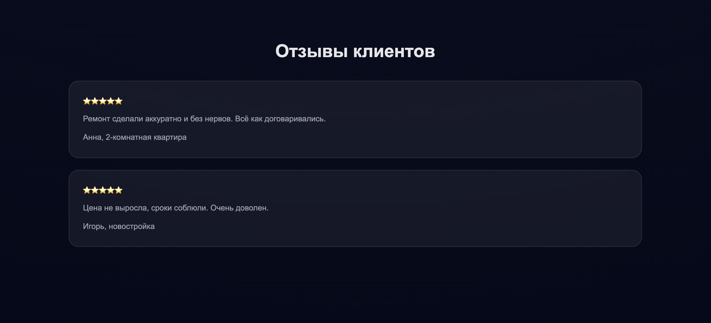
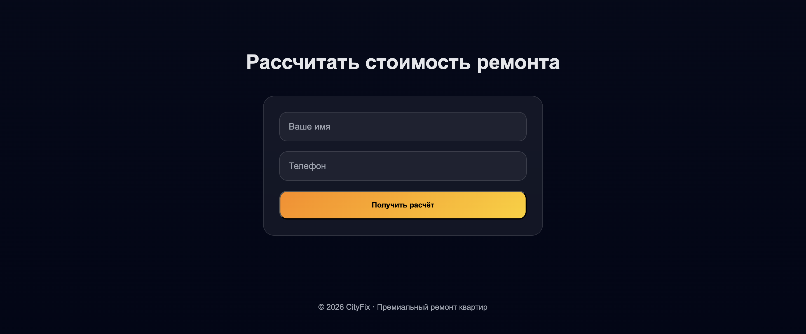

# Премиальный лендинг сервиса ремонта квартир

Это концептуальный веб-проект, созданный для демонстрации **современного коммерческого лендинга**, ориентированного на доверие, конверсию и визуальное качество.  
Сайт выполнен в стиле **modern business / premium service**: тёмная тема, градиентные акценты, стеклянные карточки и выразительная типографика.







---

## 🧩 Особенности проекта

- Современный премиальный дизайн (dark UI + градиенты)
- Glassmorphism-карточки и визуальная глубина
- Чёткая визуальная иерархия и акцент на CTA
- Полностью адаптивная вёрстка (mobile / tablet / desktop)
- Использование современных CSS-возможностей (`clamp`, CSS variables)
- Чистая структура без фреймворков
- HTML + CSS, без JavaScript

---

## 🛠 Используемые технологии

- **HTML5**
- **CSS3**
- Flexbox & Grid
- Адаптивная вёрстка
- Современная типографика

---

## 📐 Структура страницы

- Hero-блок с основным оффером  
- Преимущества компании  
- Услуги  
- Этапы работы  
- Отзывы клиентов  
- Форма заявки  
- Footer  

---

## 🚀 Как запустить

1. Клонируйте репозиторий:
```bash
git clone https://github.com/MIGHOST935/Example-2.git
